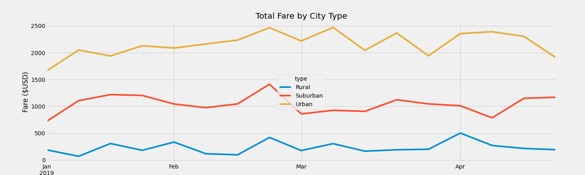

# PyBer_Analysis

## Overview

- I was tasked with the responsibility of showing the CEO of PyBer what the data would look like when analysing total rides, total drivers, and total fares in each of the city that it opperates. In addition to that I will also show the weekly fares. 

## Results 

- In the analysis I was able to see that fares in cities or urban communities were shorter therefore, less money but were more often due to less people having cars and the plaes they needed to get to were in shorter distance. People in rural and suburban areas has fewer fares but the total cost of those fares were higher. 

- Of the total data about 63% of the fare were from urban communities. The remainder were Suburbs and Rural with 30% and 7% respectively. 

- In my analysis of the drivers for PyBer I saw that 81% of drivers were in urban communites whire 16% and 3% being in Suburbs and Rural areas respectively.

- You can see in the graph below how the total fares have tracked each week of the first 4 months of 2019.

## Summary 

- The following are my three recoomendations to the CEO of PyBer.

1) In order to have more drivers in rural and suburbs, the company should pay an incentive to those drivers for the potential lost of revenue in being in those areas. 

2) The cost of a fare in rural cities are higher which doesn't show accessibility for the poeple in those areas to use the service. PyBer should offer a subscription service to get the per fare cost down while not hurting revenue.

3) Offering a service in urban cities where people can share their fare with others for a discount will increase the over revenue for that fare while maximizing efficiency for the driver. 
